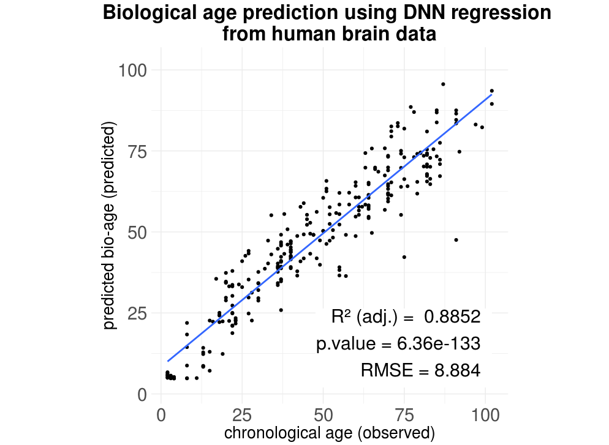
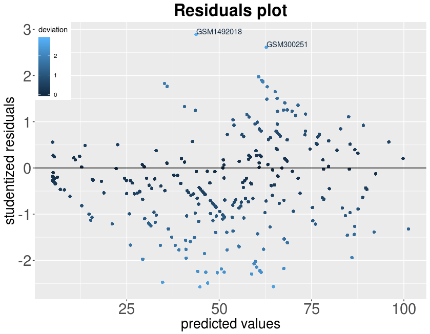

DeepNeuralNetworks4R
====================

Regression algorithm package based on ***Deep Neural Networks*** for Omic data prediction in brain transcriptomics (although as a regression model, it can be applied to **any** problem with a dependent continuous variable).

Developer: Óscar González-Velasco \[<oscargv@usal.es>\] - *Bioinformatics and functional genomics group, Cancer Research Center Salamanca (CIC-IBMCC)*

Citing this package: *Oscar González-Velasco, et al., BBA - Gene Regulatory Mechanisms, <https://doi.org/10.1016/j.bbagrm.2020.194491>*

Installation
------------

1.  The package binaries are available for download on github: <https://github.com/OscarGVelasco/DeepNeuralNetworks4R/blob/master/DeepNeuralNetworks4R_0.1.0.tar.gz>

``` r
install.packages("DeepNeuralNetworks4R_0.1.0.tar.gz")
```

2.  Or by installing it using devtools:

``` r
install_github("OscarGVelasco/DeepNeuralNetworks4R")
```

Example using the data available inside the package
---------------------------------------------------

We will use **a set of transcriptomic data from human brain samples** included on the package as an example of a **regression** model using *deep neural networks* to predict the biological age. It consist of 2 dataframes: training.data and test.data, composed of gene signal (numeric) and age of every individual:

``` r
# We load the Deep Neural Network package:
library(DeepNeuralNetworks4R)
```

We will try to predict the age of the individuals based on the gene expression of 1078 genes selected because of its implications on brain aging on cortex region (*Oscar González-Velasco, et al., BBA - Gene Regulatory Mechanisms, <https://doi.org/10.1016/j.bbagrm.2020.194491>*).

``` r
# We inspectionate the data included within the package:
training.data[1:5,1:5]
```

    ##                 GSM704248_HSB111-VFC-L.CEL.gz
    ## ENSG00000137198                      7.524863
    ## ENSG00000096060                      7.144682
    ## ENSG00000157617                      7.420950
    ## ENSG00000133048                      8.678242
    ## ENSG00000141469                      8.796922
    ##                 GSM705237_HSB187-ITC-L.CEL.gz
    ## ENSG00000137198                      8.475986
    ## ENSG00000096060                      8.037325
    ## ENSG00000157617                      7.802414
    ## ENSG00000133048                      8.554860
    ## ENSG00000141469                      9.208810
    ##                 GSM704454_HSB123-OFC-R.CEL.gz
    ## ENSG00000137198                      7.172010
    ## ENSG00000096060                      6.427262
    ## ENSG00000157617                      7.492608
    ## ENSG00000133048                      7.717559
    ## ENSG00000141469                      7.975551
    ##                 GSM704797_HSB143-OFC-R.CEL.gz
    ## ENSG00000137198                      6.760808
    ## ENSG00000096060                      7.128328
    ## ENSG00000157617                      7.358303
    ## ENSG00000133048                      7.374534
    ## ENSG00000141469                      6.679770
    ##                 GSM704826_HSB144-OFC-L.CEL.gz
    ## ENSG00000137198                      7.712089
    ## ENSG00000096060                      7.093889
    ## ENSG00000157617                      7.641471
    ## ENSG00000133048                      8.974690
    ## ENSG00000141469                      8.619703

Here we can find an except for the training dataset, *notice* that *response variables* correspond to **rows**, meanwhile *samples* correspond to **columns** .

``` r
# We will select the first 3 genes (the most significant genes linked with aging) to build 3 additional
# data matrix using each of these genes as the centroid:
zscore.targets <- as.list(rownames(training.data))[1:3]

# Print the 3 first genes
zscore.targets
```

    ## [[1]]
    ## [1] "ENSG00000137198"
    ## 
    ## [[2]]
    ## [1] "ENSG00000096060"
    ## 
    ## [[3]]
    ## [1] "ENSG00000157617"


Training the regression model
-----------------------------

First, we proceed to create the deep neural network model:

``` r
model <- deepNeuralNetwork.build(
            x=1:(nrow(training.data)-1),
            y=nrow(training.data),
            outputNeurons = 1,
            HidenLayerNeurons = c(20,20,20,10,10,10,10,10,10,10,10,10,10,10,10,10,10,10),
            traindata=training.data,
            drawDNN = 0,
            standarization = zscore.targets)
```

**x** will specify the index positions (**row numbers**) of our explanatory variables on the matrix *training.data*

**y** will specify the index positions (**row numbers**) of our observed variable on the matrix *training.data*, here it will correspond with the age.

**HidenLayerNeurons** will specify the number of neurons that each layer will have. The number of neurons on the very first layer will be the number of variables that we will use to create the regression model (deepNeuralNetwork.build calculate this automatically based on the x parameter).

**deepNeuralNetwork.build** will create an object of class *DeepNNModel* that will store all the information about the dnn model.

We train the deep neural network using the following code:

``` r
# 3. train model
# CHECK NUMBER OF ITERATIONS !
# this may take a long time depending of the volume of the data and if GPU is being used or not.

timeNN <- system.time(
  model.trained <- deepNeuralNetwork.training(
                        x=1:(nrow(training.data)-1),
                        y=nrow(training.data),
                        model = model, #ddn.model.in.use,
                        traindata=training.data,
                        testdata=test.data,
                        iterations  = 10000,
                        lr = 0.001,
                        reg = 0.001,
                        display=1000,
                        maxError = 0.1,
                        standarization = zscore.targets))
```

Testing the results
-------------------

Once we have the model, we will make use of **deepNeuralNetwork.predict** function to predict a variable based on the trained regression model:

``` r
age.prediction <- deepNeuralNetwork.predict(model.trained = model.trained,
                                            data = test.data[-nrow(test.data),],
                                            standarization = zscore.targets)
```

    ##  Standarizing Data...Standarizing data using *specific-gene Z-score with MAD...
    ## Standarizing data using *specific-gene Z-score with MAD...
    ## Standarizing data using *specific-gene Z-score with MAD...
    ## Standarizing data [by column] using *median absolute deviation(MAD) Z-score...
    ##  Completed.
    ##  Done.
    ##  Loading model... Done.
    ## 
    ##   Deep Neural Network Topology:
    ## > Number of layers: 19
    ## [Layer 1 Neurons:4305]--[Layer 2 Neurons:20]--[Layer 3 Neurons:20]--[Layer 4 Neurons:20]--[Layer 5 Neurons:10]--[Layer 6 Neurons:10]--[Layer 7 Neurons:10]--[Layer 8 Neurons:10]--[Layer 9 Neurons:10]--[Layer 10 Neurons:10]--[Layer 11 Neurons:10]--[Layer 12 Neurons:10]--[Layer 13 Neurons:10]--[Layer 14 Neurons:10]--[Layer 15 Neurons:10]--[Layer 16 Neurons:10]--[Layer 17 Neurons:10]--[Layer 18 Neurons:10]--[Layer 19 Neurons:10]--[Output layer Neurons:1]
    ## Running model...
    ## 
    ## > Prediction Completed.

Using **mplot\_linear** function included in the package we can plot the performance of our results obtained from the regression model.

``` r
mplot_lineal(observed = test.data[nrow(test.data),],
             predicted = age.prediction,
             title = "Biological age prediction using DNN regression from human brain data",
             x.lab="chronological age (years)",y.lab = "transcriptomic age")
```



We can also plot the residuals from the results of the regression model (a good model will produce random residuals); it also shows the labels of the detected outliers (we consider a studentized residual an outlier if &gt; 1.5\*IQR):

``` r
residuals_plot(observed = test.data[nrow(test.data),],
               predicted = age.prediction)
```



Using GPU for large datasets
----------------------------

The DeepNN algorithm has been optimized to be executed on a GPU card using R's matrix/vector arithmetic expressions.

The following example shows how to run the DNN on a GPU using CUDA with R's nvblas config file:

``` bash
sudo env LD_PRELOAD=/PATH/TO/CUDA/NVBLAS/libnvblas.so NVBLAS_CONFIG_FILE=/PATH/TO/NVBLAS.CONFIG.FILE/nvblas.conf R CMD BATCH ./regression.deepNN.GPU.r /dev/tty
```
